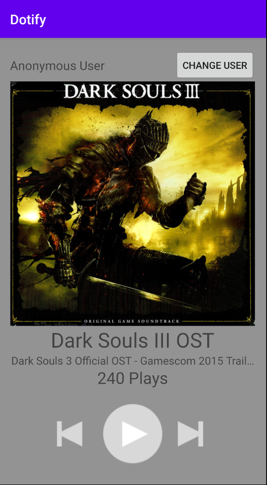

# Dotify by Erik Huang

This is a music app that doesn't play music (yet). It allows you to stare at an album cover tho.

## Extra credit
I have attempted extra credit #1, #2, and #5

## Screenshots

## Installation & Usage

Download & Install Android Studio through Android's Official Download Page:

[Android Studio](https://developer.android.com/studio)

On SDK Platforms tab, ensure that Android 10.0 (API Level 29) and Android 6.0 (API Level 23) are installed.

On SDK Tools tab, ensure the following are installed: Android SDK Build-Tools, Android SDK Platform Tools

#### Clone Project

Mac users:

`cd /Users/%USERNAME%/AndroidStudioProjects`

`git clone git@github.com:Erik-Huang/Dotify.git`

#### Build Project on a physical device

Enable USB Debugging on the device.

Connect the computer and select the device from Android Studio.

Build the project.

