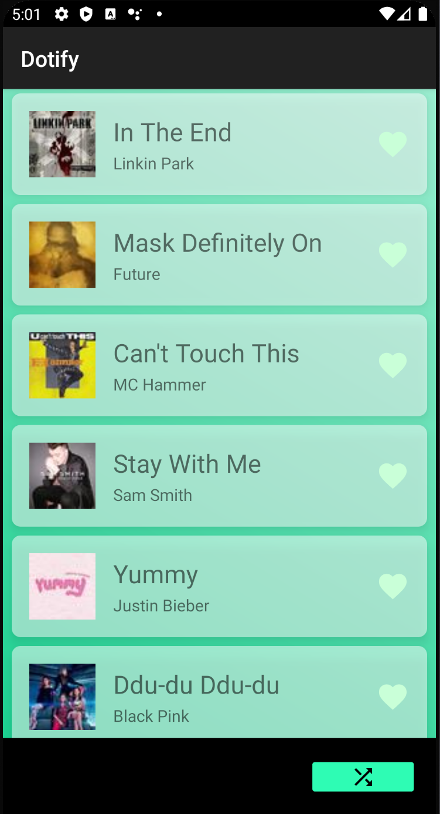

# Dotify by Erik Huang

This is a music app that pops out a list of songs at home screen. The user can shuffle the list, remove songs by long pressing on any song. Clicking on the mini play at the bottom brings the user into the song player screen.

## Extra credit
HW2: I have attempted extra credit #1, #2, and #3
hw3: None

## Screenshots

## Installation & Usage

Download & Install Android Studio through Android's Official Download Page:

[Android Studio](https://developer.android.com/studio)

On SDK Platforms tab, ensure that Android 10.0 (API Level 29) and Android 6.0 (API Level 23) are installed.

On SDK Tools tab, ensure the following are installed: Android SDK Build-Tools, Android SDK Platform Tools

#### Clone Project

Mac users:

`cd /Users/%USERNAME%/AndroidStudioProjects`

`git clone git@github.com:Erik-Huang/Dotify.git`

`git checkout hw2`

#### Build Project on a physical device

Enable USB Debugging on the device.

Connect the computer and select the device from Android Studio.

Build the project.
